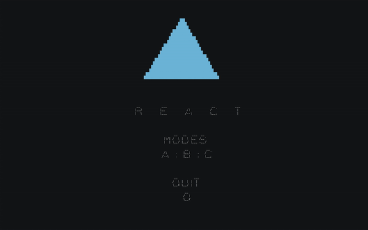

# React
A simple game that tests your reaction speed

        

### How to Play
`make` then run it with `./react`  
Once ran, main menu will show all different modes  
To choose mode: `press the letter assigned to the mode`  
To quit mode or program: `q or Q`  
Mode A - React when color turns blue. 
Reacting too early will display the color red hence will not count

### Observations
React was the one of the first exciting project ideas that I came across.
It was exciting to play the game as much it was exciting to code it. One thing 
that concerns me is the fact that there is more code in the main function than
it should be. This brings up the idea of having good and well thought structure
once again.  

---
### React is part of the [Concept](https://github.com/azimex/Concept) Series.
